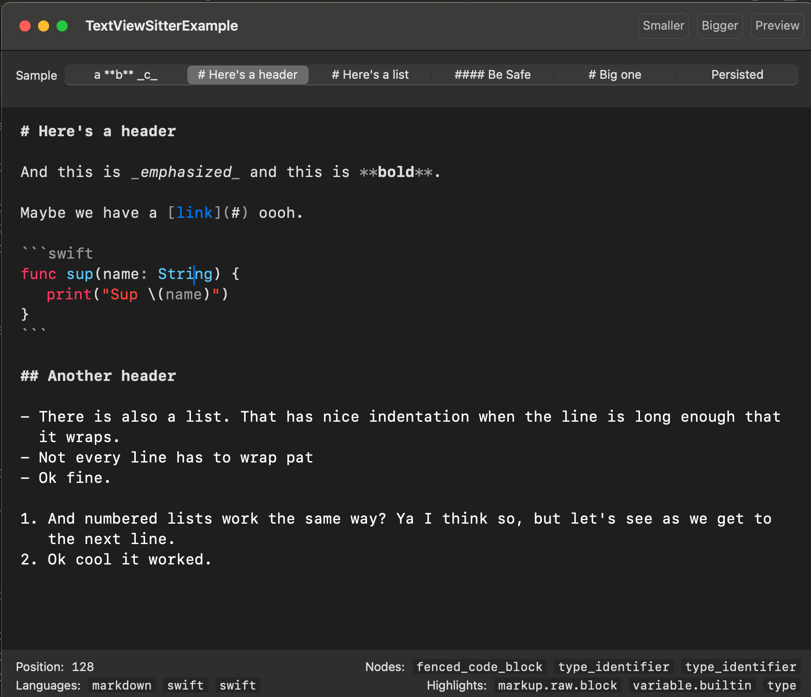

# TextViewSitter

The idea is that it highlights a UITextView/NSTextView but it's more just a way for me to learn how all this stuff works. I wouldn't recommend using it yourself. Check out [Neon](https://github.com/chimehq/neon) or [Runestone](https://github.com/simonbs/Runestone) for things that actually work.

## Reasons not to use it:

- Performance is...... catastrophic on large documents. I've more been learning how to get the behaviors correct instead of optimizing for speed. It shows!
- SO much stuff is hardcoded to work the specific way I need it to right now. There are TODOs for fixing that up but I'm not promising anything. Actually I am promising not to promise anything but that's it.
- There are so many other projects that do this stuff better, your time is precious, don't waste it!

## "It's fine I just wanna mess around"

Ok cool download the repo and you should be able to run the example project:

